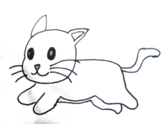
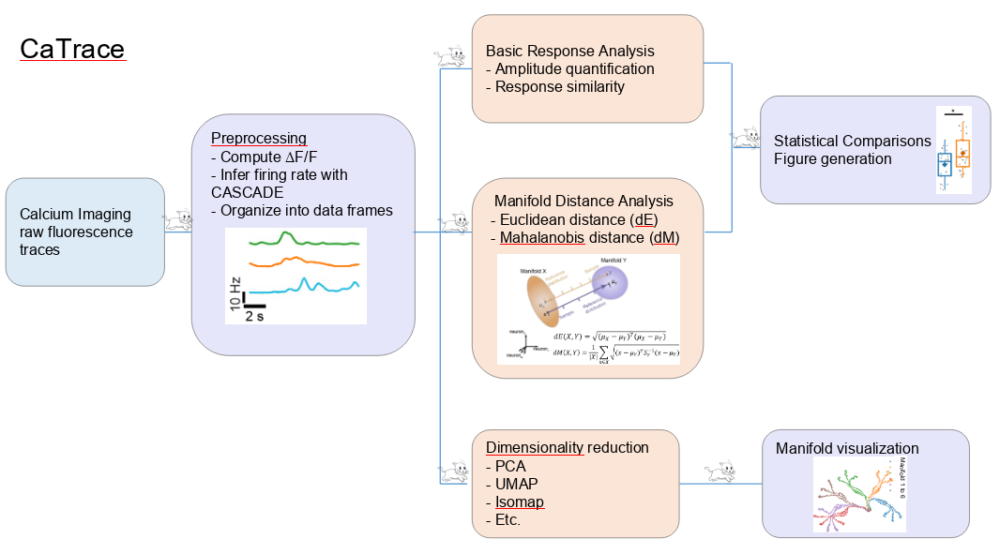

<div id="top">

<!-- HEADER STYLE: CLASSIC -->
<div align="center">



# CaTrace

<em></em>

</div>
<br>
<strong>CaTrace</strong> is a toolbox for analyzing calcium imaging time traces of neuronal population.
<br>
It offers tools for basic neuronal response analysis, including response amplitude quantification, response pattern similarity metrics.
<br>
More advanced analysis including distance between neural manifolds using Euclidean and Mahalanobis distance is included.
<br>
Statistical analysis tools are provided to detect difference between experimental groups.

---

## Overview


---
## Getting Started

### Prerequisites

The dependent python packages will automatically be installed by pip. Here a few dependent package is highlighted for important features:
- **CASCADE**: CASCADE is a toolbox by **[Rupprecht et al. 2021]** that translates calcium imaging ΔF/F traces into spiking probabilities or discrete spikes using deep learning models. CaTrace depends on it to deconvolve the ΔF/F time traces.
- **GLUE**: This is a package by **[Chou et al. 2024]** for manifold capacity analysis. The connector to this package will be accessible after the official release of GLUE.

### Installation
Install CaTrace:
```
pip install git+https://github.com/aloejhb/catrace
```
or clone the repository locally and install with
```
git clone git@github.com:aloejhb/catrace
cd catrace; pip install -e .
```

### Usage
You can use CaTrace to run analysis on a single experiment or batch your analysis across a set of experiments.

Refer to the [demos](demos/) for more examples.


---

## Features

| Feature Category                 | Feature                                                                         | 
|----------------------------------|---------------------------------------------------------------------------------|
| **Preprocessing**                | Read raw fluorescence traces                                                    |
|                                  | Compute ΔF/F traces                                                             |
|                                  | Deconvolve to infer spike probability and spike rate using CASCADE **[Rupprecht et al. 2021]**                            | 
| **Response amplitude**           | Compute neuron response during a time window                                    |
| **Pattern similarity**           | Measure the similarity between response patterns, including pattern correlation, cosine distance | 
| **Distance between manifolds**   | Compute distance between manifolds, including Euclidean distance between manifold centers (dE) and Mahalanobis distance (dM) | 
| **Dimensionality reduction**     | Reduce dimensionality of neuronal population activity patterns, including PCA, isomap, UMAP etc., using scikit-learn              |
| **Statistics and plotting**      | Perform statistical tests on experimental group data, including Mann-Whitney U, Kruskal-Wallis, t-test and plot relevant plots|
| **Correlation with behavior**    | Correlate geometric properties of neuronal representations with behavior parameters, e.g. behavior discrimination score           |


---

## Project Structure

### Project Index
<details open>
	<summary><b>catrace</b></summary>
	<blockquote>
		<div class='directory-path' style='padding: 8px 0; color: #666;'>
			<code><b>⦿ catrace</b></code>
		<table style='width: 100%; border-collapse: collapse;'>
		<thead>
			<tr style='background-color: #f8f9fa;'>
				<th style='width: 30%; text-align: left; padding: 8px;'>File Name</th>
				<th style='text-align: left; padding: 8px;'>Summary</th>
			</tr>
		</thead>
			<tr style='border-bottom: 1px solid #eee;'>
				<td style='padding: 8px;'><b><a href='https://github.com/aloejhb/catrace/blob/master/catrace/roi_group.py'>roi_group.py</a></b></td>
				<td style='padding: 8px;'>- Catrace/roi_group.py` integrates neuron group information into the main data structure<br>- It reads pre-computed neuron group assignments from a specified directory, maps group tags to descriptive names, and merges this information with the neural activity data<br>- The result is a reorganized dataframe with a multi-index incorporating plane, neuron ID, and assigned cell type, facilitating subsequent analysis.</td>
			</tr>
			<tr style='border-bottom: 1px solid #eee;'>
				<td style='padding: 8px;'><b><a href='https://github.com/aloejhb/catrace/blob/master/catrace/cluster.py'>cluster.py</a></b></td>
				<td style='padding: 8px;'>- Catrace/cluster.py` provides functionalities for clustering neuronal responses, generating descriptive dataframes, and visualizing clustering results<br>- It uses the Phenograph algorithm for clustering and offers plotting functions for cluster tuning, statistical comparisons between conditions, and UMAP embeddings, facilitating analysis of neuronal response patterns.</td>
			</tr>
			<tr style='border-bottom: 1px solid #eee;'>
				<td style='padding: 8px;'><b><a href='https://github.com/aloejhb/catrace/blob/master/catrace/dim_reduce.py'>dim_reduce.py</a></b></td>
				<td style='padding: 8px;'>- Dim_reduce.py` provides dimensionality reduction and visualization tools for the catrace project<br>- It implements various techniques like PCA, UMAP, and Isomap, computing latent representations of neural activity data<br>- The module then generates 1D, 2D, and 3D plots to visualize these reduced representations, facilitating analysis of odor responses across trials and time<br>- Cross-validation is used to optimize model parameters.</td>
			</tr>
			<tr style='border-bottom: 1px solid #eee;'>
				<td style='padding: 8px;'><b><a href='https://github.com/aloejhb/catrace/blob/master/catrace/cancorr.py'>cancorr.py</a></b></td>
				<td style='padding: 8px;'>- Cancorr.py` facilitates canonical correlation analysis (CCA) within a larger neuroscience data analysis pipeline<br>- It identifies neuron subsets significantly contributing to specific CCA components based on user-defined thresholds and criteria<br>- The functions generate component patterns by filtering neuronal activity data, leveraging pre-computed PCA and CCA results<br>- This enables the investigation of neural population activity related to identified components.</td>
			</tr>
			<tr style='border-bottom: 1px solid #eee;'>
				<td style='padding: 8px;'><b><a href='https://github.com/aloejhb/catrace/blob/master/catrace/capacity_utils.py'>capacity_utils.py</a></b></td>
				<td style='padding: 8px;'>- Capacity_utils.py<code> provides functions for statistical analysis and visualization of odor-response data<br>- It generates group comparisons, plots boxplots showing capacity and other measures, and saves these visualizations<br>- The module integrates with other parts of the </code>catrace` project, leveraging data loading and statistical functions to produce publication-ready figures and statistical summaries.</td>
			</tr>
			<tr style='border-bottom: 1px solid #eee;'>
				<td style='padding: 8px;'><b><a href='https://github.com/aloejhb/catrace/blob/master/catrace/plot_trace.py'>plot_trace.py</a></b></td>
				<td style='padding: 8px;'>- Plot_trace.py` provides visualization functions for calcium imaging data<br>- It generates various plots, including individual trace heatmaps, average trace plots across trials and odors, and mean traces with standard deviation<br>- These functions facilitate the analysis and interpretation of neuronal activity patterns within the broader catrace project<br>- The visualizations aid in understanding responses to different stimuli over time.</td>
			</tr>
			<tr style='border-bottom: 1px solid #eee;'>
				<td style='padding: 8px;'><b><a href='https://github.com/aloejhb/catrace/blob/master/catrace/response.py'>response.py</a></b></td>
				<td style='padding: 8px;'>- The <code>response.py</code> module processes calcium imaging data to analyze neuronal responses to odors<br>- It computes and normalizes responses, allowing for selection of top-performing neurons<br>- The module generates visualizations, including box plots and histograms, comparing responses across different conditions and odors, facilitating statistical analysis and result interpretation within the broader catrace project.</td>
			</tr>
			<tr style='border-bottom: 1px solid #eee;'>
				<td style='padding: 8px;'><b><a href='https://github.com/aloejhb/catrace/blob/master/catrace/utils.py'>utils.py</a></b></td>
				<td style='padding: 8px;'>- Catrace/utils.py` provides utility functions for the catrace project<br>- It offers data manipulation tools for Pandas DataFrames, config file management using JSON and dataclasses, command-line argument generation, and functions for odor pair generation and deduplication<br>- The module also includes functions for number formatting and seed generation from hash values, enhancing data processing and experiment reproducibility.</td>
			</tr>
			<tr style='border-bottom: 1px solid #eee;'>
				<td style='padding: 8px;'><b><a href='https://github.com/aloejhb/catrace/blob/master/catrace/snn_dataio.py'>snn_dataio.py</a></b></td>
				<td style='padding: 8px;'>- Snn_dataio.py` processes spiking neural network (SNN) simulation output<br>- It converts spike timing data into firing rates, organizing the data by odor, trial, and time<br>- The module facilitates data analysis by transforming raw spike data into a structured format suitable for further processing and analysis within the broader catrace project, likely involving odor-response analysis.</td>
			</tr>
			<tr style='border-bottom: 1px solid #eee;'>
				<td style='padding: 8px;'><b><a href='https://github.com/aloejhb/catrace/blob/master/catrace/classification.py'>classification.py</a></b></td>
				<td style='padding: 8px;'>- Classification.py implements a template matching algorithm for odor identification<br>- It processes time-series data, focusing on specific temporal windows, to compute average responses for different odors<br>- A Euclidean or cosine distance metric compares test data against a template, generating odor labels<br>- The algorithms accuracy is implicitly evaluated through comparison to ground truth (commented-out code suggests error rate calculation)<br>- This module contributes to the projects overall odor classification capability.</td>
			</tr>
			<tr style='border-bottom: 1px solid #eee;'>
				<td style='padding: 8px;'><b><a href='https://github.com/aloejhb/catrace/blob/master/catrace/frame_time.py'>frame_time.py</a></b></td>
				<td style='padding: 8px;'>- Catrace/frame_time.py<code> provides a function to convert time values from seconds to frame numbers<br>- It leverages NumPy for efficient array-based calculations, facilitating the conversion process within the broader </code>catrace` project, likely used for synchronizing or indexing events based on frame rate<br>- This function is crucial for handling temporal data within the applications video or animation processing pipeline.</td>
			</tr>
			<tr style='border-bottom: 1px solid #eee;'>
				<td style='padding: 8px;'><b><a href='https://github.com/aloejhb/catrace/blob/master/catrace/dataio_read_matlab_struct.py'>dataio_read_matlab_struct.py</a></b></td>
				<td style='padding: 8px;'>- The <code>catrace/dataio_read_matlab_struct.py</code> module facilitates data loading and organization within the broader catrace project<br>- It reads experimental configurations and neural activity data from MATLAB files, processes spike information, and constructs pandas DataFrames for subsequent analysis<br>- Specifically, it integrates time traces and experimental metadata, streamlining data access for downstream processing steps.</td>
			</tr>
			<tr style='border-bottom: 1px solid #eee;'>
				<td style='padding: 8px;'><b><a href='https://github.com/aloejhb/catrace/blob/master/catrace/_version.py'>_version.py</a></b></td>
				<td style='padding: 8px;'>- The <code>_version.py</code> file manages the projects version information<br>- It defines the version string and tuple, automatically generated during the build process<br>- This ensures consistent version reporting across the <code>catrace</code> application, facilitating tracking and management of releases<br>- The version data is used throughout the codebase for identification and potentially conditional logic.</td>
			</tr>
			<tr style='border-bottom: 1px solid #eee;'>
				<td style='padding: 8px;'><b><a href='https://github.com/aloejhb/catrace/blob/master/catrace/mahal.py'>mahal.py</a></b></td>
				<td style='padding: 8px;'>- Computations of odor manifold distances are performed using Mahalanobis or Euclidean metrics<br>- The code calculates distances between pairs of odor manifolds, offering options for data shuffling to assess the robustness of distance measures<br>- Results are organized into dataframes and matrices, facilitating visualization of odor relationships via heatmaps<br>- The module integrates with other project components for data preprocessing and visualization.</td>
			</tr>
			<tr style='border-bottom: 1px solid #eee;'>
				<td style='padding: 8px;'><b><a href='https://github.com/aloejhb/catrace/blob/master/catrace/deconvolve.py'>deconvolve.py</a></b></td>
				<td style='padding: 8px;'>- Catrace/deconvolve.py<code> deconvolves calcium imaging data to estimate spike probabilities<br>- It uses a pre-trained model (specified in a configuration file) and a noise estimation method to process time traces, handling data organization via pandas DataFrames<br>- The module integrates with the </code>cascade2p` library for model prediction and provides a structured output of spike probability estimates for each neuron across different experimental conditions.</td>
			</tr>
			<tr style='border-bottom: 1px solid #eee;'>
				<td style='padding: 8px;'><b><a href='https://github.com/aloejhb/catrace/blob/master/catrace/similarity.py'>similarity.py</a></b></td>
				<td style='padding: 8px;'>- The <code>catrace/similarity.py</code> file calculates similarity matrices for neural activity patterns within the larger <code>catrace</code> project<br>- It leverages loaded trace data (likely from <code>catrace/dataio.py</code>) to compute both cosine distance and correlation matrices, providing measures of similarity between different trials or experimental conditions<br>- These matrices are crucial for downstream analyses within the <code>catrace</code> project, likely used for assessing the consistency and reproducibility of neural responses.</td>
			</tr>
			<tr style='border-bottom: 1px solid #eee;'>
				<td style='padding: 8px;'><b><a href='https://github.com/aloejhb/catrace/blob/master/catrace/stats.py'>stats.py</a></b></td>
				<td style='padding: 8px;'>- The <code>catrace/stats.py</code> file provides statistical analysis functions for the <code>catrace</code> project<br>- Specifically, it includes a function (<code>incremental_histogram</code>) designed to efficiently compute histograms from very large datasets by processing them in smaller chunks<br>- This is crucial for handling potentially massive trace data common in performance analysis tools, as suggested by the project structure (though the structure itself is not provided)<br>- The file also imports libraries for more advanced statistical tests (Mann-Whitney U, Kruskal-Wallis, t-test, bootstrapping), indicating its role in comparing and analyzing different performance metrics within the <code>catrace</code> system.</td>
			</tr>
			<tr style='border-bottom: 1px solid #eee;'>
				<td style='padding: 8px;'><b><a href='https://github.com/aloejhb/catrace/blob/master/catrace/visualize.py'>visualize.py</a></b></td>
				<td style='padding: 8px;'>- The <code>catrace/visualize.py</code> file is responsible for generating visualizations within the <code>catrace</code> project<br>- Specifically, it provides functions to create heatmaps, leveraging pre-loaded colormaps, for displaying and analyzing pattern data<br>- This contributes to the overall project goal by offering a visual representation of the statistical analyses performed elsewhere in the codebase (likely within the <code>catrace/stats.py</code> module, judging by the imports)<br>- The visualizations aid in interpreting the results of experiments and understanding the underlying patterns in the data.</td>
			</tr>
			<tr style='border-bottom: 1px solid #eee;'>
				<td style='padding: 8px;'><b><a href='https://github.com/aloejhb/catrace/blob/master/catrace/dataset.py'>dataset.py</a></b></td>
				<td style='padding: 8px;'>- Catrace/dataset.py` defines a configuration class for datasets and provides functions to load and access dataset parameters<br>- It facilitates management of experimental details like odor lists, conditions, and file paths, enabling flexible configuration of the catrace projects data processing and analysis<br>- The module ensures consistent access to experiment-specific settings.</td>
			</tr>
			<tr style='border-bottom: 1px solid #eee;'>
				<td style='padding: 8px;'><b><a href='https://github.com/aloejhb/catrace/blob/master/catrace/process_time_trace.py'>process_time_trace.py</a></b></td>
				<td style='padding: 8px;'>- Process_time_trace.py` provides functions for processing and analyzing time-series data, primarily fluorescence traces from calcium imaging experiments<br>- It offers functionalities for dF/F calculation, response onset detection, trace alignment, data selection based on various criteria (e.g., time windows, odors), and averaging across trials or neurons<br>- The module facilitates data manipulation for downstream analysis within the larger calcium imaging data processing pipeline.</td>
			</tr>
			<tr style='border-bottom: 1px solid #eee;'>
				<td style='padding: 8px;'><b><a href='https://github.com/aloejhb/catrace/blob/master/catrace/align_per_odor.py'>align_per_odor.py</a></b></td>
				<td style='padding: 8px;'>- Align_per_odor.py` processes calcium imaging data to determine peak activation times for each odor presented<br>- It fits Gaussian or bi-exponential curves to the average response, aligning trials based on these calculated peak times<br>- The script uses curve fitting techniques to refine peak time estimations, enhancing the accuracy of subsequent data analysis within the broader calcium trace analysis pipeline.</td>
			</tr>
			<tr style='border-bottom: 1px solid #eee;'>
				<td style='padding: 8px;'><b><a href='https://github.com/aloejhb/catrace/blob/master/catrace/exp_collection.py'>exp_collection.py</a></b></td>
				<td style='padding: 8px;'>- The <code>catrace/exp_collection.py</code> file within the <code>catrace</code> project facilitates the analysis and visualization of experimental data<br>- Specifically, it handles loading experimental data (<code>load_dfovf</code>), calculating and plotting the correlation between neural activity patterns across different odor stimuli (<code>plot_exp_pattern_correlation</code>)<br>- This module leverages other modules within the <code>catrace</code> project, such as <code>pattern_correlation</code>, <code>process_time_trace</code>, and <code>dataio</code>, to perform these tasks, contributing to the overall experimental data processing and analysis pipeline.</td>
			</tr>
			<tr style='border-bottom: 1px solid #eee;'>
				<td style='padding: 8px;'><b><a href='https://github.com/aloejhb/catrace/blob/master/catrace/nrnpca.py'>nrnpca.py</a></b></td>
				<td style='padding: 8px;'>- Nrnpca.py` performs principal component analysis (PCA) on calcium imaging data<br>- It reads time-series data, applies PCA dimensionality reduction, and visualizes the results using scatter plots and confidence ellipses<br>- The script facilitates the analysis of neural responses to different stimuli by representing high-dimensional data in a lower-dimensional space, aiding in the interpretation of odor-evoked activity patterns.</td>
			</tr>
			<tr style='border-bottom: 1px solid #eee;'>
				<td style='padding: 8px;'><b><a href='https://github.com/aloejhb/catrace/blob/master/catrace/process_neuron.py'>process_neuron.py</a></b></td>
				<td style='padding: 8px;'>- Process_neuron.py` facilitates neuron selection within the catrace project<br>- It processes neural activity data, identifying neuron assemblies based on specified criteria (e.g., top responding neurons or a percentile threshold)<br>- The module then filters the data, retaining only neurons belonging to these assemblies, and saves the results, including an assembly membership matrix, for downstream analysis<br>- This enhances the analysis of neural responses to odors.</td>
			</tr>
			<tr style='border-bottom: 1px solid #eee;'>
				<td style='padding: 8px;'><b><a href='https://github.com/aloejhb/catrace/blob/master/catrace/param.py'>param.py</a></b></td>
				<td style='padding: 8px;'>- Catrace/param.py<code> centralizes configuration management within the </code>catrace<code> project<br>- It facilitates saving experiment parameters, instantiating a configuration object, and serializing it to a JSON file (</code>config.json`) within the designated output directory<br>- This ensures reproducible and easily accessible experiment setups across the entire catrace application.</td>
			</tr>
			<tr style='border-bottom: 1px solid #eee;'>
				<td style='padding: 8px;'><b><a href='https://github.com/aloejhb/catrace/blob/master/catrace/distance_measure.py'>distance_measure.py</a></b></td>
				<td style='padding: 8px;'>- Catrace/distance_measure.py computes and analyzes distances between neural activity patterns. It calculates distance matrices using various metrics (e.g., Euclidean, cosine) across different trials and odors, visualizes these distances, and computes distances from a starting point.</td>
			</tr>
			<tr style='border-bottom: 1px solid #eee;'>
				<td style='padding: 8px;'><b><a href='https://github.com/aloejhb/catrace/blob/master/catrace/dataio.py'>dataio.py</a></b></td>
				<td style='padding: 8px;'>- Catrace/dataio.py` provides data input/output functionalities for the catrace project<br>- It handles loading of time-series neural data and spike predictions from a specified directory structure, processing this data into pandas DataFrames for analysis<br>- The module also extracts experimental parameters from configuration files<br>- This facilitates efficient data access and manipulation within the broader catrace analysis pipeline.</td>
			</tr>
			<tr style='border-bottom: 1px solid #eee;'>
				<td style='padding: 8px;'><b><a href='https://github.com/aloejhb/catrace/blob/master/catrace/behavior.py'>behavior.py</a></b></td>
				<td style='padding: 8px;'>- The <code>catrace/behavior.py</code> module processes behavioral data from a MATLAB file<br>- It calculates area under the curve (AUC) values for various behavioral parameters, adjusting for baseline activity<br>- These AUCs, along with derived per-day measures, are organized into pandas DataFrames for subsequent analysis within the larger catrace project, facilitating the study of behavioral time courses.</td>
			</tr>
			<tr style='border-bottom: 1px solid #eee;'>
				<td style='padding: 8px;'><b><a href='https://github.com/aloejhb/catrace/blob/master/catrace/fit_curve.py'>fit_curve.py</a></b></td>
				<td style='padding: 8px;'>- Fit_curve.py` fits double exponential functions to neural response data, estimating parameters for each odor presented<br>- It uses curve fitting techniques to model the probability of a neuron spiking over time<br>- The module computes peak response times and provides plotting functionality, contributing to the overall data analysis and visualization within the catrace project.</td>
			</tr>
			<tr style='border-bottom: 1px solid #eee;'>
				<td style='padding: 8px;'><b><a href='https://github.com/aloejhb/catrace/blob/master/catrace/pattern_correlation.py'>pattern_correlation.py</a></b></td>
				<td style='padding: 8px;'>- Pattern_correlation.py` analyzes neuronal response patterns across different odor stimuli<br>- It computes and visualizes correlation matrices, quantifying the similarity of neural activity over time<br>- Decorrelation analyses assess how these correlations change, revealing temporal dynamics of neural representations<br>- The module integrates with data loading and processing components within the broader catrace project.</td>
			</tr>
			<tr style='border-bottom: 1px solid #eee;'>
				<td style='padding: 8px;'><b><a href='https://github.com/aloejhb/catrace/blob/master/catrace/scale.py'>scale.py</a></b></td>
				<td style='padding: 8px;'>- Standardization, min-max scaling, and quantile scaling, along with centering<br>- A specialized function scales data based on a response variables average within a specified time window, facilitating data normalization for subsequent analysis within the broader <code>catrace</code> data processing pipeline.</td>
			</tr>
		</table>
		<!-- run Submodule -->
		<details>
			<summary><b>run</b></summary>
			<blockquote>
				<div class='directory-path' style='padding: 8px 0; color: #666;'>
					<code><b>⦿ catrace.run</b></code>
				<table style='width: 100%; border-collapse: collapse;'>
				<thead>
					<tr style='background-color: #f8f9fa;'>
						<th style='width: 30%; text-align: left; padding: 8px;'>File Name</th>
						<th style='text-align: left; padding: 8px;'>Summary</th>
					</tr>
				</thead>
					<tr style='border-bottom: 1px solid #eee;'>
						<td style='padding: 8px;'><b><a href='https://github.com/aloejhb/catrace/blob/master/catrace/run/run_capacity.py'>run_capacity.py</a></b></td>
						<td style='padding: 8px;'>- Run_capacity.py` performs a pairwise comparison of neural responses to different odors<br>- It processes neural activity data, selecting specified time windows and odors, then applies a geometric comparative method (GCMC) analysis<br>- The results, quantifying the difference in neural manifolds between odor pairs, are saved for downstream analysis within the broader CATRACE project<br>- The script supports parameter configuration via JSON input.</td>
					</tr>
					<tr style='border-bottom: 1px solid #eee;'>
						<td style='padding: 8px;'><b><a href='https://github.com/aloejhb/catrace/blob/master/catrace/run/run_distance.py'>run_distance.py</a></b></td>
						<td style='padding: 8px;'>- The <code>catrace/run/run_distance.py</code> script analyzes neural response similarity across different experimental conditions within the larger <code>catrace</code> project<br>- It leverages other modules (like <code>catrace.exp_collection</code>, <code>catrace.pattern_correlation</code>, <code>catrace.mahal</code>) to compute and visualize distance matrices representing the similarity of neural activity patterns<br>- The scripts primary purpose is to generate statistical comparisons and visualizations (e.g., boxplots, heatmaps) of these distances, ultimately assessing the impact of experimental manipulations on neural responses<br>- This contributes to the overall project goal of characterizing neural activity patterns and their relationships to experimental conditions.</td>
					</tr>
					<tr style='border-bottom: 1px solid #eee;'>
						<td style='padding: 8px;'><b><a href='https://github.com/aloejhb/catrace/blob/master/catrace/run/run_utils.py'>run_utils.py</a></b></td>
						<td style='padding: 8px;'>- Run_utils.py<code> provides utility functions for data analysis within the catrace project<br>- It generates plots of average neural traces, highlighting specified time windows<br>- Crucially, it processes and prepares data for group-versus-group comparisons, facilitating analyses contrasting neural responses to different odor combinations, leveraging the </code>DatasetConfig` and other modules for data access and manipulation.</td>
					</tr>
					<tr style='border-bottom: 1px solid #eee;'>
						<td style='padding: 8px;'><b><a href='https://github.com/aloejhb/catrace/blob/master/catrace/run/run_correlate_with_behavior.py'>run_correlate_with_behavior.py</a></b></td>
						<td style='padding: 8px;'>- The <code>run_correlate_with_behavior.py</code> script analyzes fish behavioral data<br>- It correlates pre-computed distance metrics from fish trajectories with behavioral measures<br>- The script loads data, performs statistical analysis, generates regression plots visualizing the relationship between distance and behavior, and returns the regression model and plot<br>- This facilitates investigation into the relationship between movement patterns and behavior.</td>
					</tr>
					<tr style='border-bottom: 1px solid #eee;'>
						<td style='padding: 8px;'><b><a href='https://github.com/aloejhb/catrace/blob/master/catrace/run/run_pattern_similarity.py'>run_pattern_similarity.py</a></b></td>
						<td style='padding: 8px;'>- The <code>run_pattern_similarity.py</code> script analyzes neural response similarity across different experimental conditions<br>- It computes similarity matrices using specified metrics (cosine distance or pattern correlation), generates visualizations of these matrices at both individual fish and condition levels, and assesses differences between naive and trained responses<br>- The script also outputs cross-trial similarity data and performs comparisons between odor groups.</td>
					</tr>
					<tr style='border-bottom: 1px solid #eee;'>
						<td style='padding: 8px;'><b><a href='https://github.com/aloejhb/catrace/blob/master/catrace/run/run_average_timecourse.py'>run_average_timecourse.py</a></b></td>
						<td style='padding: 8px;'>- Run_average_timecourse.py` generates average timecourse plots from neural activity data<br>- It processes data, potentially converting spike probability to rate, and creates visualizations showing average responses across trials, separating naive and trained conditions<br>- Individual fish traces can also be plotted<br>- The function outputs both processed data and generated figures.</td>
					</tr>
					<tr style='border-bottom: 1px solid #eee;'>
						<td style='padding: 8px;'><b><a href='https://github.com/aloejhb/catrace/blob/master/catrace/run/run_capacity_bias_scale_dependent.py'>run_capacity_bias_scale_dependent.py</a></b></td>
						<td style='padding: 8px;'>- The script performs a comparative analysis of neural activity patterns for two specified odors within a defined time window<br>- It preprocesses neural manifold data, applying downsampling and optional Gaussianization<br>- Geometric comparisons using the GCMC library quantify the similarity of neural responses to the two odors, saving the results for later aggregation and statistical analysis within the broader CATRACE project.</td>
					</tr>
				</table>
			</blockquote>
		</details>
	</blockquote>
</details>

---

## License

Catrace is protected under the [LICENSE](https://choosealicense.com/licenses) License. For more details, refer to the [LICENSE](https://choosealicense.com/licenses/) file.

---

<div align="right">

[![][back-to-top]](#top)

</div>


[back-to-top]: https://img.shields.io/badge/-BACK_TO_TOP-151515?style=flat-square


---


[def]: demos\
